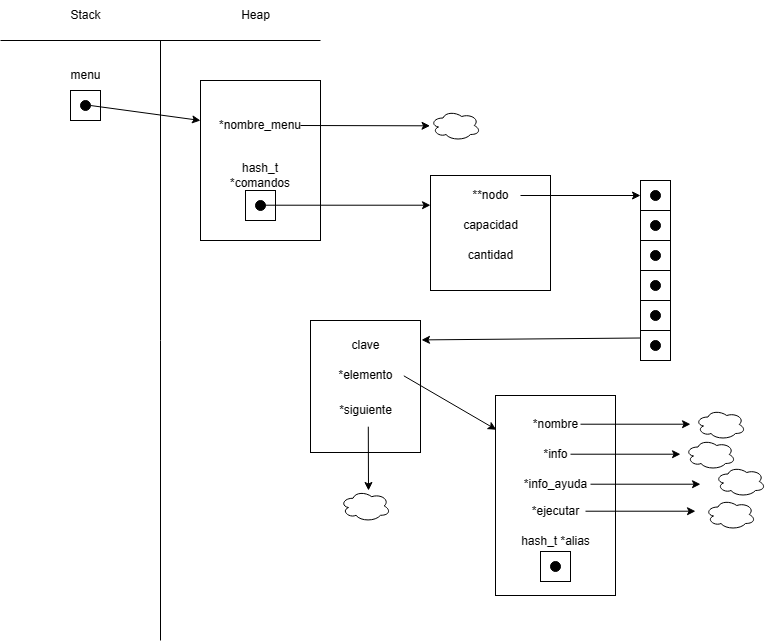
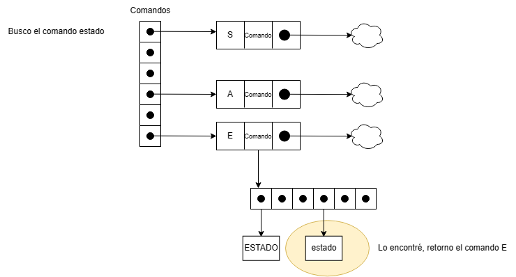
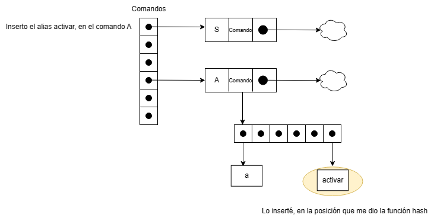
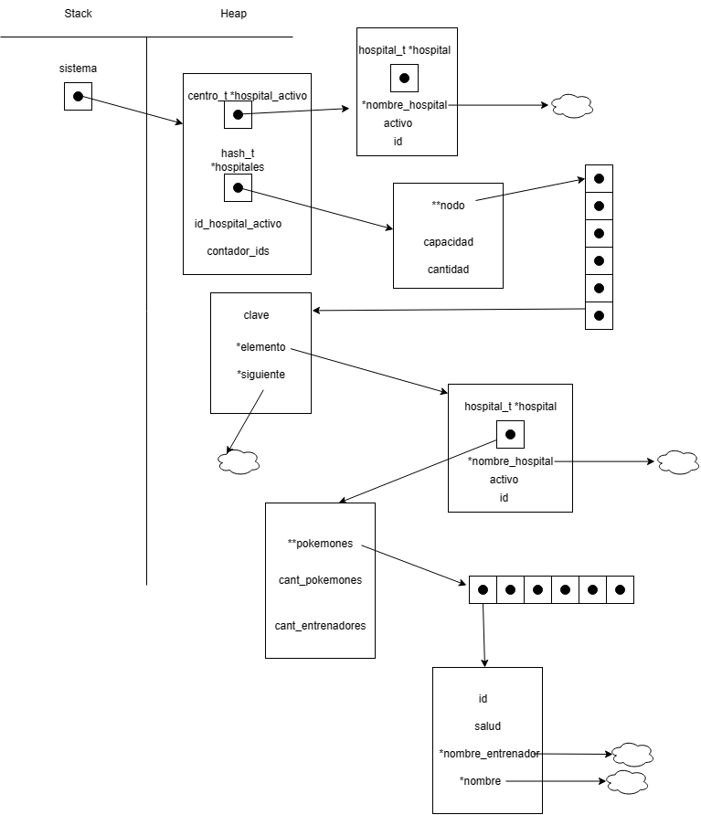

<div align="right">

</div>

# TP2

## Repositorio de Jonathan Dominguez - 110057 - chondominguez55@gmail.com

- Para compilar:

```bash
gcc -std=c99 -Wall -Wconversion -Wtype-limits -pedantic -Werror -O2 -g src/*.c pruebas_chanutron.c -o pruebas_chanutron
```

- Para ejecutar:

```bash
./pruebas_chanutron
```

- Para ejecutar con valgrind:
```bash
valgrind --leak-check=full --track-origins=yes --show-reachable=yes --error-exitcode=2 --show-leak-kinds=all --trace-children=yes ./pruebas_chanutron
```
---
##  Funcionamiento

A continuación voy a explicar las funciones más importantes de Menú.

Pero primero, el diagrama de memoria:

<div align="center">

</div>

<br>Muchas de las complejidades de mis funciones estan totalmente asociadas a las complejidades del TDA Hash.

Para empezar mi menu consta de un nombre y un hash de comandos.
Donde un comando tiene un nombre, informacion, informacion de ayuda, una funcion que ejecuta lo que hace y un hash de alias.

Esta estructura armada me permite tener varios comandos a la vez y tambien otras formas de llamar a un comando.
A su vez, tener la información al alcance de la mano, tanto como la por defecto como la de ayuda.

<br>Función `menu_contiene_comando`

Primero verificamos que el comando pasado por parametro exista mediante la función `hash_obtener`. En caso de no existir, estaríamos hablando de un "alias" o de un comando inexistente. La única forma de verificar esto es recorriendo todo el hash comandos, para luego recorrer el hash alias del comando. Para ello usamos la función iteradora del hash llamada `hash_con_cada_clave` y le pasamos pasamos una función que nos permita recorrer el hash alias. De esta forma, si el comando pasado existe como alias, se va a devolver el comando correspondiente. Caso contrario, vamos a retornar NULL para indicar que no existe.

<div align="center">

</div>

<br>Función `menu_ejecutar_comando`

Invocamos la función mencionada arriba. Si nos devolvió un comando, vamos a poder ejecutar su función. Si nos devolvió NULL, vamos retornar true, para no cortar con el ciclo del tp2.

<br>Función `comando_agregar_alias`  

Si el comando pasado por parametro no tiene un hash de alias, se lo vamos a crear con la función `hash_crear`. Una vez creado o si ya tenía, mediante la función `hash_insertar` agregamos el alias al hash alias del comando. En el caso de todo haya funcionado, retornamos el comando. Sino, NULL.

<div align="center">

</div>

<br>Función `menu_con_cada_comando`

Esta es la función que itera el menú. Usa totalmente la función `hash_con_cada_clave` que itera el hash de comandos.

<br>Función `menu_destruir`

Se encarga de liberar toda la memoria ocupada por el menu. Pero para ello, necesitamos destruir los comandos, pero antes de eso vamos a tener que destruir sus alias.
Para esto usaremos `menu_con_cada_comando` y le pasaremos una función que nos sirva para este caso. Donde esa función se va a encargar de liberar el hash alias y luego liberar el comando. Y por último liberamos el hash comandos y el menu.

<br>Bueno, ahora voy a explicar mi implementación en el tp2.

Pero antes, el diagrama de memoria:

<div align="center">

</div>

Para empezar mi sistema consta de un contador de ids, un hash hospitales, el hospital activo y la id del hospital activo.
Un hospital o en mi caso un centro tiene un hospital, un nombre de hospital, un estado para saber si esta activo o no y una id.

Esta implementación es conveniente debido a que un centro tiene una id y un estado.

A su vez el sistema sabe cual es el hospital que esta activo y su id.

<br>Función `ejecutar_salir`

Para llevar a cabo esta función, debemos entender que tenemos que meternos en lo profundo de la estructura para poder ir liberando de a poco. Para ello usamos la función `hash_con_cada_clave` que nos va a permitir iterar el hash hospitales y le pasamos una función que se encarga de destruir cada centro. Una vez liberada toda la memoria ocupada por los centros, resta liberar el sistema y el menu.

<br>Función `ejecutar_cargar`

Se pide una dirección de archivo, la cual tiene todos los datos del hospital. Para crear un hospital necesitamos de esa dirección. Entonces usamos `hospital_crear_desde_archivo` que dependiendo de la situación nos devuelve un puntero a hospital o NULL. Si nos devuelve NULL, se tira un error por pantalla. Y en caso de que nos devuelva un hospital lo agregamos a nuestro hash hospitales con la función `hash_insertar`.

<br>Función `ejecutar_activar`  

Se pide una id, y se verifica que sea válida. 
1) En caso de que sea una id inválida si tira un mensaje de error.
2) Si esa es la misma del hospital que esta activo se le va a informar al usuario que ya esta activo ese hospital.
3) En caso de que sea válida y ya haya un hospital activo, se va a desactivar el activo y se cambia por este nuevo.
4) Y por ultimo, en caso de que no sea ninguna de las anteriores, basicamente que no tengo ningún hospital activo se busca el hospital y se lo activa.

Haciendo así que el sistema tenga un puntero a ese hospital.

<br>Función `ejecutar_destruir`

Primero se verifica que haya un hospital activo, en caso de que no exista se muestra un mensaje de error.
En caso de que exista uno, se lo va eliminar con la función `hash_quitar` que lo quita del hash de hospitales. Pero despuúes vamos a necesitar destruir todo el centro, por lo cual se usa una función auxiliar que se encarga de hacer eso mismo.
Una vez eso, actualizamos la información necesaria del sistema.

## Respuestas a las preguntas teóricas

***¿Que TDA conviene utilizar?  ¿Que problema habría la reemplazar dicha estructura?  ¿Habría algún problema con las pruebas?***

En mi opinión, me parece mucho más útil el uso de un ABB. Ya que puedo armar un árbol de pokemones, donde este organizado en base a la salud de los mismos. Como en un hospital lo que busco mayormente es el pokemon con menor salud,  puedo recorrer el árbol por INORDEN  y voy a tener los pokemones que tengan más prioridad en tema de salud.

No, de hecho es cambiar el vector de pokemones por un abb. Y la estructura ya estaría.
Ahora, faltaría adaptar el código a un abb. No hace falta cambiar las firmas ni nada de eso en verdad. Por lo tanto no debería de haber ningún problema si se implementa como es debido.

</br>Tabla de complejidades entre ABB y Lista enlazada

|          Operación           | Lista Enlazada | ABB      |
|------------------------------|----------------|----------|
| hospital_crear_desde_archivo | O(n)           | O(log n) |
| hospital_a_cada_pokemon      | O(n)           | O(n)     |
| hospital_aceptar_emergencias | O(n)           | O(log n) |
| hospital_obtener_pokemon     | O(n)           | O(log n) |
| hospital_destruir            | O(n)           | O(n)     |

Como podemos ver, el uso de un ABB reduce la complejidad de las funciones en su mayoría. 
Por lo cual, si lo que buscamos es menor complejidad en las operaciones, el uso del ABB es muy adecuado para este caso.